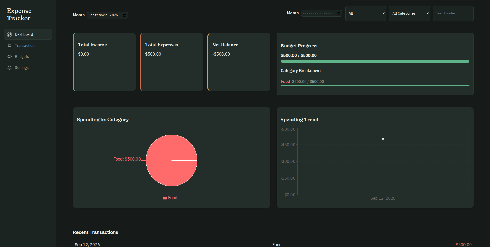

# 🏷 Expense & Budget Tracker

A personal finance app end-to-end, record income & expenses, categorize them, set monthly budgets, and visualize spending

## 📌 Problem Statement

I just finished a 5 weeks react studies and this project gives me an opportunity to apply all the concepts i learned. This gave me a better understand of the programming language as a whole.

## 🎯 Project Goals

For Transactions

- A form to add a transaction (Type, amount, Catergory, note, data)
- Validate before saving
- Show inline validation errors
- List all transactions, most recent first
- Edit an existing transaction
- Delete a transaction with a confirmation step
- Show an empty state when there are no transactions
- Ship a set of sensible default categories (e.g. Food, Transport,      Rent, Salary, Entertainment)
- Filter the transaction list by month, type, category
- Search transactions by note text
- Show an empty state when nothing matches the current filters

For Budgets

- Set a monthly budget amount
- For each budget show progress for the selected month
- Use a visual progress bar
- Clearly flag when a category is over budget

Dashboard

- For the selected month, show summary cards:
     Total income
     Total expenses
     Net balance (income − expenses)
- Show overall budget progress
- Show a short list of the most recent transactions

- All data (transactions, custom categories, budgets, theme) persists to `localStorage`
- Data survives a full page refresh

 Theme (Light / Dark)

- Toggle between light and dark mode
- Persist the user's preference

- Empty states for: no transactions, no search/filter results, no chart data
- Guard against bad input and corrupt stored data (don't let the app white-screen)

## Bonus Features

- Budget alerts / notifications when nearing a limit
- Multi-currency support

## 🛠 Tech Stack

**Frontend:**  

- React  
- CSS

**Other Tools:**

- Git & GitHub
- Lucide react for icons
- React Router for the rounting
- Recharts for the chart and trend
- Vercel (Deployment)

## 🖥 Features

- Form validation
- CRUD operations
- Responsive design
- Error handling

## 📷 Screenshots



## ⚙ Installation & Setup

Clone the repository:

```bash
git clone https://github.com/karl-Rollins/React_Expense_Tracker.git

cd React_Expense_Tracker
```

**Install dependencies:**

npm install

**Run the project:**

npm run dev

## 🧠 Challenges Faced

- Handling the movement of data between components
- Managing protected routes in React
- Creating and Implementing custom hooks in context

## 📚 What I Learned

- How to structure a fullstack application
- Managing state in React
- Debugging  errors

## Future Improvements

- Add authentication
- Improve UI and UX especially for the Mobile

## 👨🏽‍💻 Author

NGANGSI Karl Alaindo

Junior Fullstack Developer

📩 Email: [karlrollins25@gmail.com](mailto:karlrollins25@gmail.com)

🌍 Based in Cameroon | Open to remote opportunities
